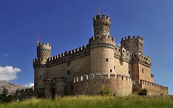

# ImageSearch

## Descrição

Esse projeto busca encontrar imagens em um dataset próprio a partir de classes do [ImageNet](http://www.image-net.org/).

O dataset consiste em aproxidamente 1000 imagens de 200 classes distintas.

O dataset não é público, mas o projeto funciona com quaisquer imagens na pasta `images/`.

## Técnicas Utilizadas

Para a busca de imagens, usou-se uma rede neural pré-treinada, o `MobileNet`, para prever a probabilidade de cada imagem do dataset para cada classe descrita do [ImageNet](http://www.image-net.org/).

Essas probabilidades são então guardaas no arquivo `probs.pickle`, e esse arquivo é utilizado no processo de busca.

## Requerimentos

As dependências do projeto estão presentes no arquivo `requirements.txt`

Para instalá-las com `pip`, execute o seguinte comando:

```
$ pip install -r requirements.txt
```

## Utilização

Crie a pasta `images/` com o dataset com as imagens desejadas na raiz do projeto.

Execute o script `busca_imagens.py` com o argumento `--term` com o termo desejado.

O termo deve ser uma classe válida do [ImageNet](http://www.image-net.org/).

Exemplo:

```
$ python busca_imagens.py --term monastery
```

As probabilidades calculadas das imagens do dataset são gravadas em um arquivo `probs.pickle`.

Caso haja alguma mudança no dataset ou seja desejado recalcular as probabilidades, use a flag `--build-index`

Exemplo:

```
$ python busca_imanges.py --term monastery --build-index
```

## Resultados

Para termos do `ImageNet` que possuem imagens no dataset correspondetes, o resultado foi excelente.

Por exemplo, buscando pelo termo `castle`, o resultado foram as três seguintes imagens:

Confiança: 99.93%



Confiança: 97.89%


Confiança: 97.38%


São resultados plenamente satisfatórios, pois são imagens muito semelhantes a caste.

Já para termos que não possuem imagens semelhantes, como por exemplo `snowmobile`, os resultados foram os seguintes:

Confiança: 0.77%


Confiança: 0.38%


Confiança: 0.36%


Mesmo as imagens não sendo satisfatórias em relação ao termo, percebe-se que a confiança das mesmas é baixíssima, ou seja, o problema é a falta de imagens no dataset, e não o algoritmo em si.

Um resultado melhor para a maioria dos termos possíveis pode ser alcançado com um dataset de imagens maior e mais diverso.
